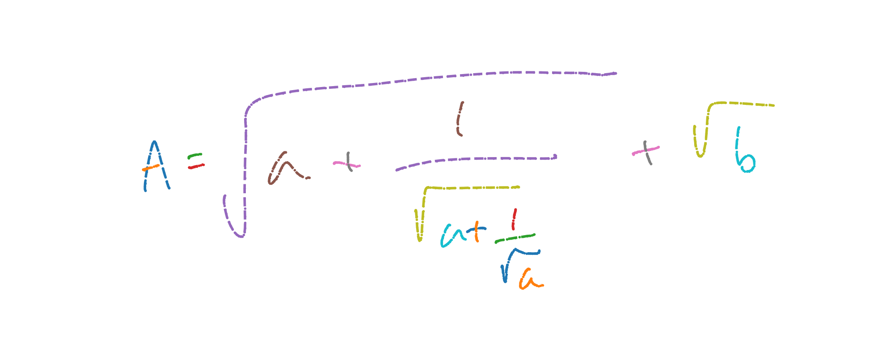
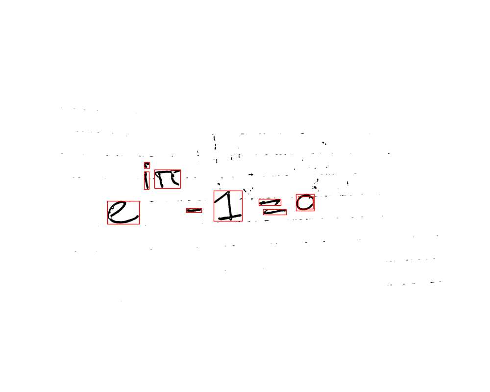

# Capstone Project - Rendering Handwritten Equations

By Martijn de Vries  
martijndevries91@gmail.com

## Problem Statement

As a data scientist at a small tech startup, I have been tasked with developing a new tool that can render equations into digital format. Using the 2011-2013 CROHME datasets of handwritten equations and mathematical symboos, I will build a tool that accepts an image of an handwritten equation, predicts which symbols are on the image, and then renders the equation and  LaTeX. Both the image of the equation and the latex representation should be returned. For the symbol recognition, I will use a pre-trained EfficientNetB0 Convolutional Network. In order to evaluate the success of the model, we will look both at how accurately the model can predict individual symbols. I will also calculate the 'Demerau-Levenshtein' distance between the predicted vs ground truth equation strings, in order to gauge how succesfull the full pipeline is in resolving the equation.

## Software Requirements

To run the code in this repository, I have used the following python libraries
<ul>
    <li> Numpy version 1.23.5 </li>
    <li> Matplotlib version 3.7.1 </li>
    <li> OpenCV (or cv2) version 4.7.0 </li>
    <li> Jellyfish version 0.11.2 </li>
    <li> Tensorflow version 2.10.0. <b>Note:</b> In order to save the efficientnet model using tensorflows model.save() function, I had to edit some code in the package folder. It appears that efficientNet does save with no issues on Tensorflow 2.9 or lower</li>
</ul>

## Repository Overview
    
This repository consists of the following:

<ul>
   <li> The directory <code>./code</code> contains 4 notebooks and several .py files that walk through the project:
   
   <ol>
    <li> In <b>data_processing.ipynb</b> I inspect the inkML data and process them into image files to be used later in the analysis. Two types of images are generated: individual symbol images (to train the model on), and full equation images (to evaluate the performance of the full pipeline at the end </li>
    <li> In <b> resolve_symbols.ipynb</b>, I do a bit of EDA on some of the image data, and create the preprocessing pipeline </li>
    <li> In <b>CNN_training.ipynb</b>, I load in the image data of individua models an train an efficientNetB0 model to classify individual symbols </li>
    <li> In <b> equation_rendering.ipynb</b>, I develop the final step of the pipeline to turn a list of predictions into an equation </li>
     </ol>
     Additionally, there are 3 .py files that helper functions that contain the majority of the pre and post-processing code:
     <ol>
       <li> The file <b>box_positions.py</b> contains the BoxPositions class, which is used in the pre-processing pipeline to compare the bounding boxes of symbols in various ways </li>
    <li>The file <b>resolve_symbols.py</b> contains the code for the pre-processing step </li>
    <li> The file <b>render_equations.py </b>contains most of the code for the post-processing step </li>
    </ol>
      Finally, the file equation_app.py contains a streamlit application that runs the code
</li>
    <li> The directory <code>./CNN_model/</code> contains the trained efficientNetB0 model, used to make predictions on images of individual symbols, as well as a txt file with all the class labels in order </li>
       <li> The directory <code>./img_data/</code> is used for the image data that the model is trained on and that the pipeline is evaluated on. Because of storage space, only 3 handwritten equations by me are included, in <code>./img_data/handwritten/</code>. The other files are created in the data processing notebook </li>
   <li> The directory <code>./figures</code> contains all the figures that are saved during the analysis in the notebooks, in .png formats </li>
    <li> The slides for the project presentation are in the file <code>equation_rendering_slides.pdf</code> </li>
</ul>

## Data Overview and Processing

The CROHME (Competition for Recognition of Handwritten Mathematical Expressions) dataset was created over the course of several years as part of a Handwriting Recognition conference. More information on the dataset can be found <a href=https://www.isical.ac.in/~crohme/CROHME_data.html>here</a>. The data itself was obtained from <a href=https://www.kaggle.com/datasets/rtatman/handwritten-mathematical-expressions>Kaggle</a>. For storage space reasons, the data is not included in this repository, and needs to be downloaded separately.

The data is contained in a special 'inkML' format. Each inkML file contains coordinate lists, which outline handwritten traces of symbols. Each trace, or stroke, is a separate entry, and symbols might consist of multiple traces. There is also a 'traceGroup' property, which shows which traces together form a symbol. Additionally, the label of individual symbols, as well as the full equation shown in the image, is included.

In the data processing notebook. I read in the inkML training data files from the 2011-2013 competitions. The majority of the data is written out as small images of individual symbols, which are used to train the model. About a 1000 equation files are saved as full equation images, which are used to evaluate the performance of the full pipeline. An example of an inkML file, with all traces plotted in individual colors, is shown below.

 
 
In order to train the model, images of individual symbols are created from the inkML files, using matplotlib, and written out into separate directories. Additionally,  about 10% of the inkML files are held back in order to evaluate the overall performance of the equation rendering pipeline. 

For the individual symbol images, a random value for the linewidth is generated for each symbol when the images are created. This is done so that the CNN can recognize symbols drawn at different linewidths.
 

## Pipeline Summary

The full pipeline to turn a handwritten equation into a digital one consists of 3 major steps:

<ol>
    <li> <b>Resolving symbols</b> In the pre-processing step, the image is loaded in, tresholded, and individual symbols are detected on the image. Additionally, some essentialy information, such as the order the symbols should appear in, is inferred. </li>
    <li> <b>Model prediction:</b> An EfficientNetB0 Convolutional Neural Network was trained to recognize individual symbols. The images from the pre-processing step are fed to the model, and a prediction is made for each symbol </li>
    <li> <b>Equation rendering:</b> In thE post-processing step, the predicted labels for each symbol are stitched together into an equation, using the predictions and the information from the pre-processing step</li>
</ol>

A high-level overview of each step is given below. More detail on the exact steps taken can be found in the notebooks.

### 1) Resolving symbols

As a first step, when the image is uploaded it is thresholded towards black and white values. For the inkML files, this is somewhat trivial as the images were created digitally. However, the tool should also be able to handle real-world pictures with imperfections and shadows. For those images, a three-step process is applied: firstly, the images is tresholded with adaptive gaussian tresholding. This process often will still result in small-scale features on the image that we would like to remove. To remove these features, a Gaussian blurring, and then a second, binary tresholding is applied to remove these small-scale features (more information on tresholding in openCV can be found <a href=https://docs.opencv.org/4.x/d7/d4d/tutorial_py_thresholding.html>here</a>).

Next, the symbols are detected with openCVs <a href=https://docs.opencv.org/3.4/d3/dc0/group__imgproc__shape.html#ga17ed9f5d79ae97bd4c7cf18403e1689a>findContours()</a> function. In order to further ignore small imperfections on the image, only contours with bounding boxes above a certain size (relative to the total image size) are considered. An example of a thresholded image (an equation handwritten by me), with the bounding boxes from findContours() overlayed, is shown below.

 

There are a few crucial steps that the pre-processing pipeline needs to take before individual symbols can be fed to the model for prediction: for example, some boxes bound inner contours,  which should not be included. Additionally, some boxes are actually part of a single symbol, like in the 'equals' sign. Additionally, we need to know the order of the symbols, as well as additional information how they relate to other symbols in the equation: are they in a fraction, are they subscripts or superscript? Are they below a limit sign or above a summation sign? The pre-processing pipeline tries to take care of each of these things, primarily by making informed guessess about symbols using the relative locations of the boxes on the image. An example of the same image after pre-processing is shown below:

 
 
 The pre-processing pipeline has correctly figured out: 1) which boxes are inner contours, and removed them, 2) that the 'equals' sign and the factorial should be considered single symbols, 3) the order the symbols should be read in, 4) the fact that the symbols in the 'limit' sign and within the fraction are related to eachother, in what I refer to as a  'stack', and 5) which symbols are superscripts. 
 
We can also see that the pipeline is not foolproof. In the example above, the infinity symbol is incorrectly guessed not to be a part of the stack, because it extends a little too far out from under the limit sign.

The output of the preprocessing pipeline is as follows
<ol>
 <li>A list of 2D image arrays, each with a single symbol (ordered by appearance in the equation)</li>
 <li>A list of the 'level' of each symbol, where a 'level' is a set of adjacent symbols that can be read left-to-right </li>
 <li> The 'stack value' of each symbol, where a value of 0 means the symbol is unstacked (there are no symbols above or below it that it has any relation to), and 1,2 and 3 indicate the top, middle (if it exists), and bottom levels of a stack respectively</li>
 <li> The 'script level' of each symbol where a level of 0 means the symbol is at base level, a level of -1 means the symbol is a subscript, a level of 1 means the symbol is a superscript, etc </li>
 <li> The 'extend list' of each symbol. This list for now only exists so that the equation rendering function knows when to close out a root sign. </li>
 <li> If plot=True, an image with the boundign boxes for each symbol (color coded on whether they are base level symbols, in a stack, or super/subscripts) is also shown, and a pyplot ax object is returned
 </ol>

### 2) Model Prediction

This is the most straightforward step of the pipeline. The efficientNetB0 model that is trained in <b>CNN_training.ipynb</b> is loaded in, and each of the symbol images from the pre-processing step are fed to the model. A list of predictions is then returned.
The output of this step is symbol a list of predicted class labels.

### 3) Equation Rendering

After the predictions have been made, the individual labels need to be stitched into a full equation. This is done in the equation rendering step. An overview of the steps that are taken here:

<ol>
    <li> The equation first checks which symbols belong together in a level, and loops over the symbols level-by-level </li>
    <li> Before the loop over individual symbols in the level starts, I make a check to see if some individual symbols are not in fact characters like lim, sin cos or tan. This because findContours() in the preprocessing pipeline often does not see these functions as a single symbol, because they are not written together in a single line. If a match is found, all the symbol/stack/level/script level lists are updated appropiately </li>
    <li> If the stack level is zero, the equations are simply appended with white space in between, adding superscript and subscripts where necessary (and curly brackets). Additionally, there is a check whether the script level makes sense with equation logic. For example, I assume that an equals sign can never be the first symbol in a subscript or superscript. If this is found, update the script levels appropriately </li>
    <li> If we are in a stack, check what the middle symbol is (like a sum or a fraction) and add curly brackets and sub/superscript symbols where necessary </li>
    <li> If one of the predicted symbols was a root sign, figure out when to close out that root sign </li>
</ol>

Two examples of an equation prediction, one perfect one and one not-as-good one, are shown below:

 

 

## Evaluating the full pipeline performance

Although the EfficientNetB0 CNN performs well during training, with an accuracy of around 95% on the validation data, ultimately we want to know in how well the pipeline does at rendering a full equation. In order to gauge this, I compute the string distance betweeen the predicted and actual equation labels.
The distance metric I've decided to use is the <a href=https://en.wikipedia.org/wiki/Damerau%E2%80%93Levenshtein_distance>Damerau-Levenshtein</a> distance metric or <i> edit distance</i>, which computes the number of insertions, deletions, substitutions or transpositions that are necessary to change one of the labels into the other. Additionally, I normalize by the ground truth string length. A normalized distance of 0.5 therefore means that half of the string characters needed to be inserted, deleted, substituted or transported between the predicted and actual labels.

The actual LaTeX string contains symbols like \\sin and \\theta, which should be counted the same as one-character symbols like 1 or 2. Therefore, I 're-label' the equations, changing out each symbol for ASCII characters, before computing the metric. 'Structural' parts of the equation string, like curly brackets or sub and superscript characters (like ^ and \_) which do not arise from the symbol prediction but are added in the postprocessing step, are also included in the distance metric calculation.

The image below shows the overal performance in terms of the normalized Damerau-Levenshtein distance. A distance of zero means that the equation was perfectly rendered. A distance of 0.5 means that only half of the symbols in the predicted equation were in the right location. Furthermore, we also split the evaluation up in three kinds of equations: equations with lim or sum signs, equations with trigonometric symbols, and all other equations

 
 
 For all equations, we make a perfect prediction around $15.7\%$ of the time, and put at least half of the symbols in the right spot around $65.9\%$.

## Overall Conclusions

Although this Handwritten equation tool serves as an important step in the right direction, the current iteration is only able to render a handwritten equation with perfect accuracy for about $15\%$ equations of the testing data. 

Generally speaking, it is clear that math equations are difficult to render accurately because the symbols are not read in simply left-to-right but depend on each other in some way depending on their position in the equation. The large variety of symbols, and (in principle) arbitrarily large complexity of an equation, makes it very difficult for this tool to account for all possible scenarios. 

Despite these challenges, with more work this tool could be improved. A few areas of improvement are listed below:

<ol>
    <li> <b> Model Training: </b> Overall, it appears that the accuracy of individual symbol predictions is not as high as the 95% seen on the validation data during the training. This is likely related to the the fact that the individual symbol images are all created in the same manner. Training the model on images that are more blurry or sharp, or more varied in linewidth, might make the model more robust. Given the relatively long training times of the EfficientNet CNN, finding the configuration that leads to the best prediction is a time consuming process. </li>
    <li> <b> Script level: </b> The script level part of the pre-processing pipeline is somewhat heuristic, and does not always do a good job at correctly labeling the script level. A noteable example is subscripts following symbols such as y and g, which extend below the handwriting baseline - in that case, the bounding box of the subscript typically does not extend the preceding box, and is not identified as subscript. For the script level labeling to be reliable, more work needs to be done at understanding the difference between different script levels. Making the labeling depend on not just the relationship to the preceding symbol, but several symbols on the same level, would also improve this step. </li>
    <li> <b> Multi-character symbols: </b> Because of the findContours() function, the tool often has trouble identifying symbols such as $\sin$, $\cos$ or $\lim$, as these are often not handwritten together. Additionally, sometimes symbols like $x$ or $k$ are identified as two separate contours because the individual traces do not touch each other. More work is needed in the pre-processing pipeline to do this correctly. To some extent, I tried to correct for this in the post-processing - eg. if there are three adjacent symbols such as $s$, $i$, and $n$, these are replaced by a single $\sin$. But ideally, this would be fixed in pre-processing. One potential solution would be incorporating some iterative functionality in the pre-processing, where 'test' predictions are made such that better inferences could be made about the way the equation should be structured. </li>
</ol>